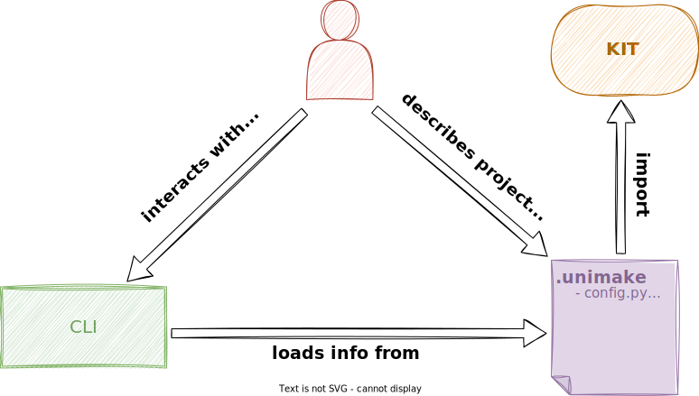

# Unimake
`unimake` is a set of development tools and frameworks for project maintaining. This tools makes it easy to organize development routines (such as building, testing, linting, running, etc) for a specific code base.

## Goals
- Allow gophers to use the full power of Python instead of makefiles and shell scripts.
- Facilitate the task of product building consisting of several projects in different languages.
- Provide the opportunity to develop debuggable project maintenance scripts.
- Automate project maintenance routines.

## Features
- Convenient framework for a project description
- Python is the only language for everything
- Debuggable pipeline (unlike regular shell scripts)
- Easiest way to create a powerful CLI (like `make` but more flexible)
- Adapters for a commonly used build systems (`go`, `cmake`, ...)
- Run project targets in remote environment (dev-container, remote server, etc)

# How it works ?
Unimake provides the Python framework (`umk`) and project commandline tool (`umk`).

A specific project must contain at least 1 module:
- `.unimake/project.py` - project info, target descriptions and release function
Other modules are optionals:
- `.unimake/config.py` - contains project config class and config presets
- `.unimake/remotes.py` - contains remote environments to run targets in


## Sample project
Sources are [here](docs/sample).
### Project and targets
```py
# File      .unimake/config.py
# Optional  no

from umk.kit import project, target
from config import Config


@project.golang
def _(s: project.Golang):
    s.info.id = "sample"
    s.info.name = "Sample Project"
    s.info.description = "Sample project detailed description"
    s.info.version = "v0.2.0"
    s.info.contrib("John Doe", "john.doe@mail.com")


@target.go.binary
def _(s: target.GolangBinary, c: Config, p: project.Golang):
    s.name = "server"
    s.label = "Server"
    s.description = "Server application"
    s.tool = p.tool
    s.build.output = p.layout.root / "server"
    s.build.source = [p.layout.cmd / "server"]
    s.debug.port = c.debug.port  # Read debug port from config


@target.go.mod
def _(s: target.GolangMod, p: project.Golang):
    s.name = "deps.go"
    s.label = "Golang Dependencies"
    s.description = "List of golang packages required to build project"
    s.tool = p.tool
    s.path = p.layout.root


@target.packages
def _(s: target.SystemPackages):
    s.name = "deps.os"
    s.label = "System Package Dependencies"
    s.description = "List of system packages required to build project"
    s.apt_get.sudo = True
    s.apt_get.items = ["golang"]


@project.releaser
def _(c: Config):
    target.run("deps.os")
    target.run("deps.go")
    if c.debug.on:
        target.run("server")
    else:
        target.run("server.release")
```
### Config
```py
# File      .unimake/config.py
# Optional  yes 

from umk import core
from umk.kit import config


@config.register
class Config(config.Interface):
    class Debug(core.Model):
        on: bool = core.Field(False, description="Enable debug info")
        port: int = core.Field(default=2345, description="Port to start debugger on")
    debug: Debug = core.Field(default_factory=Debug)
    usermod: bool = core.Field(True, description="Create user inside development container")


@config.preset(name="local")
def _(s: Config):
    s.debug.port = 2020
```
### Development environment
```py
# File      .unimake/remote.py
# Optional  yes

from umk.kit import remote, project, system
from umk.kit.adapter import docker
from config import Config


@remote.docker.compose
def _(s: remote.DockerCompose, c: Config, p: project.Golang):
    s.name = "dev"
    s.description = "Project development container"
    s.default = True

    u = system.user()

    # Dockerfile
    f = docker.File(path=p.layout.root, name="dev.dockerfile")
    f.froms("ubuntu")
    if c.usermod:
        f.run([
            f"apt-get update",
            f"apt-get -y install sudo",
            f"mkdir -p /etc/sudoers.d",
            f'echo "{u.name} ALL=(ALL) NOPASSWD:ALL" > /etc/sudoers.d/nopasswd',
            f"groupadd -g {u.group.id} {u.name}",
            f"useradd -m -u {u.id} -d /home/{u.name} -g {u.group.id} -s /bin/sh {u.name}",
        ])
        f.user(u.id)
        f.env("PATH", f"$PATH:/home/{u.name}/.local/bin")
        f.run([f"sudo chown {u.name}:{u.name} /home/{u.name}"])
        f.run([
            "sudo apt-get -y install git",
            "sudo apt-get -y install python3",
            "sudo apt-get -y install pip",
        ])
    else:
        f.run([
            "apt-get -y install git",
            "apt-get -y install python3",
            "apt-get -y install pip",
        ])
    f.run(["pip install umk"])

    # Compose service
    b = docker.ComposeService()
    b.build = docker.ComposeBuild()
    b.build.context = f.path
    b.build.dockerfile = f.name
    b.image = "project-image"
    b.container_name = "dev"
    b.ports = ["2233:2233"]
    b.hostname = "dev"
    b.working_dir = "/workdir"
    if c.usermod:
        b.user = f"{u.id}:{u.group.id}"
        b.working_dir = f"/home/{u.name}/workdir"
    b.volumes.bind(src=p.layout.root, dst=b.working_dir)
    b.entrypoint = ["sleep", "infinity"]

    s.dockerfiles.append(f)
    s.composefile.services["dev"] = b
    s.composefile.path = p.layout.root
    s.service = "dev"
```

## CLI
### Main
```bash 
umk --help
```
```
Usage: umk [OPTIONS] COMMAND [ARGS]...

Options:
  -R      Execute in the default or specific remote environment
  --help  Show this message and exit.

Commands:
  config   Config management commands
  format   Format .unimake/*.py files
  inspect  Inspect project details
  release  Release project
  remote   Remote environments management commands
  run      Run project targets
  target   Project targets management commands

```
### Config

```bash
umk config --help
```
```
Usage: umk config [OPTIONS] COMMAND [ARGS]...

  Config management commands

Options:
  --help  Show this message and exit.

Commands:
  clean    Remove saved config file
  inspect  Print default config details
  presets  Print config presets
  save     Save project config
  write    Write entry inside config file

```

### Target
```bash
umk target --help
```
```
Usage: umk target [OPTIONS] COMMAND [ARGS]...

  Project targets management commands

Options:
  -F       Load config from file
  -P TEXT  Config preset to apply
  -C TEXT  Config entry override
  --help   Show this message and exit.

Commands:
  inspect  Inspect targets details
  ls       List project targets

```

### Remote
```bash
umk remote --help
```
```
Usage: umk remote [OPTIONS] COMMAND [ARGS]...

  Remote environments management commands

Options:
  -n TEXT  Remote environment name
  -F       Load config from file
  -P TEXT  Config preset to apply
  -C TEXT  Config entry override
  --help   Show this message and exit.

Commands:
  build     Build remote environment
  destroy   Destroy remote environment
  down      Stop remote environment
  download  Download files from remote environment
  exec      Execute command in remote environment
  inspect   Show remote environment details
  login     Login remote environment
  ls        List project remote environments
  shell     Open remote environment shell
  up        Start remote environment
  upload    Upload files to remote environment

```
## Inspections

### Project and targets
```bash 
umk inspect
```


### Config: default
```bash
umk config inspect
```


### Config: apply preset (see debug.port)
```bash 
umk config inspect -P local
```


### Config: override entries
```bash 
umk config inspect -C debug.port=7777 -C usermod=no
```


### Targets
```
umk target inspect server
```
```
Name               Value                                                                                                                                                                                   
Name               server                                                                                                                                                                                  
Label              Server (debug)                                                                                                                                                                          
Description        Server application (with debug info)                                                                                                                                                    
Tool               go                                                                                                                                                                                      
Build              -o /umk/docs/sample/server -gcflags=all=-N -l /umk/docs/sample/cmd/server
```

```
umk target inspect server.release
```
```
Name           Value                                                                                                                                                                
Name           server.release                                                                                                                                                       
Label          Server (release)                                                                                                                                                     
Description    Server application                                                                                                                                                   
Tool           go                                                                                                                                                                   
Build          -o /umk/docs/sample/server -gcflags=-dwarf=false -ldflags=-s -w /umk/docs/sample/cmd/server 
```
### Remote environments
```
umk remote inspect
```
```
┏━━━━━━━━━━━━━━━┳━━━━━━━━━━━━━━━━━━━━━━━━━━━━━━━━━━━━━━┳━━━━━━━━━━━━━━━━━━━━━━━━━━━━━━━━━━━━━━━━━━━━━━━━━━━━━━━━━━━━━━━━━━━━━━━━━┓
┃ Name          ┃ Description                          ┃ Value                                                                   ┃
┡━━━━━━━━━━━━━━━╇━━━━━━━━━━━━━━━━━━━━━━━━━━━━━━━━━━━━━━╇━━━━━━━━━━━━━━━━━━━━━━━━━━━━━━━━━━━━━━━━━━━━━━━━━━━━━━━━━━━━━━━━━━━━━━━━━┩
│ name          │ Remote environment name              │ dev                                                                     │
├───────────────┼──────────────────────────────────────┼─────────────────────────────────────────────────────────────────────────┤
│ description   │ Remote environment description       │ Project development container                                           │
├───────────────┼──────────────────────────────────────┼─────────────────────────────────────────────────────────────────────────┤
│ default       │ Is default                           │ True                                                                    │
├───────────────┼──────────────────────────────────────┼─────────────────────────────────────────────────────────────────────────┤
│ service       │ Target compose service               │ dev                                                                     │
├───────────────┼──────────────────────────────────────┼─────────────────────────────────────────────────────────────────────────┤
│ sh            │ Shell command (sh, bash, zsh, ...)   │ ['bash']                                                                │
├───────────────┼──────────────────────────────────────┼─────────────────────────────────────────────────────────────────────────┤
│ tty           │ Instantiate tty when call 'execute'  │ True                                                                    │
├───────────────┼──────────────────────────────────────┼─────────────────────────────────────────────────────────────────────────┤
│ composefile   │ Docker compose file object.          │ services:                                                               │
│               │                                      │   dev:                                                                  │
│               │                                      │     build:                                                              │
│               │                                      │       context: /home/edward/astra/projects/umk/docs/sample              │
│               │                                      │       dockerfile: dev.dockerfile                                        │
│               │                                      │     container_name: dev                                                 │
│               │                                      │     entrypoint:                                                         │
│               │                                      │     - sleep                                                             │
│               │                                      │     - infinity                                                          │
│               │                                      │     hostname: dev                                                       │
│               │                                      │     image: project-image                                                │
│               │                                      │     ports:                                                              │
│               │                                      │     - 2233:2233                                                         │
│               │                                      │     user: 1011:1001                                                     │
│               │                                      │     volumes:                                                            │
│               │                                      │     - type: bind                                                        │
│               │                                      │       source: /home/edward/astra/projects/umk/docs/sample               │
│               │                                      │       target: /home/edward/workdir                                      │
│               │                                      │     working_dir: /home/edward/workdir                                   │
│               │                                      │                                                                         │
├───────────────┼──────────────────────────────────────┼─────────────────────────────────────────────────────────────────────────┤
│ dockerfile[0] │ Dockerfile object [0]                │ FROM ubuntu                                                             │
│               │                                      │                                                                         │
│               │                                      │ RUN apt-get update && \                                                 │
│               │                                      │     apt-get -y install sudo && \                                        │
│               │                                      │     mkdir -p /etc/sudoers.d && \                                        │
│               │                                      │     echo "edward ALL=(ALL) NOPASSWD:ALL" > /etc/sudoers.d/nopasswd && \ │
│               │                                      │     groupadd -g 1001 edward && \                                        │
│               │                                      │     useradd -m -u 1011 -d /home/edward -g 1001 -s /bin/sh edward        │
│               │                                      │                                                                         │
│               │                                      │ USER 1011                                                               │
│               │                                      │                                                                         │
│               │                                      │ ENV PATH=$PATH:/home/edward/.local/bin                                  │
│               │                                      │                                                                         │
│               │                                      │ RUN sudo chown edward:edward /home/edward                               │
│               │                                      │                                                                         │
│               │                                      │ RUN sudo apt-get -y install git && \                                    │
│               │                                      │     sudo apt-get -y install python3 && \                                │
│               │                                      │     sudo apt-get -y install pip                                         │
│               │                                      │                                                                         │
│               │                                      │ RUN pip install umk                                                     │
│               │                                      │                                                                         │
├───────────────┼──────────────────────────────────────┼─────────────────────────────────────────────────────────────────────────┤
│ logins        │ Private repositories login info      │ []                                                                      │
└───────────────┴──────────────────────────────────────┴─────────────────────────────────────────────────────────────────────────┘
```
## Remote environment
### Build and up
First of all you need is to `build` an `up` environment (any type of environments are not buildable and upable)
```bash
umk remote build
umk remote up
```
### Execute commands
We can execute arbitrary command in the remote environment by `umk remote exec`

```bash
umk remote exec ls
umk remote exec ls -- -l -a
```
If you want execute `umk` commands you can use convenient way instead of `umk remote exec umk ...`

```bash
umk -R run ...
umk -R release
```
You can execute just `run ...` and `release`, other `umk` commands are not allowed

### Open shell
If you want to explore remote environment you can open the shell

```bash
umk remote shell
```


### Specify remote environment
Above approach allows you to manipulate with `default` environment (see `umk.remote.Interface.default=True`),
but if your project declares multiple remotes, you can specify one.

```bash
umk remote -n dev build
umk remote -n dev up
```
```bash
umk remote -n dev exec ls
umk remote -n dev exec ls -- -l -a
```
```bash
umk -R=dev run ...
umk -R=dev release
```
```bash
umk remote -n dev shell
```
